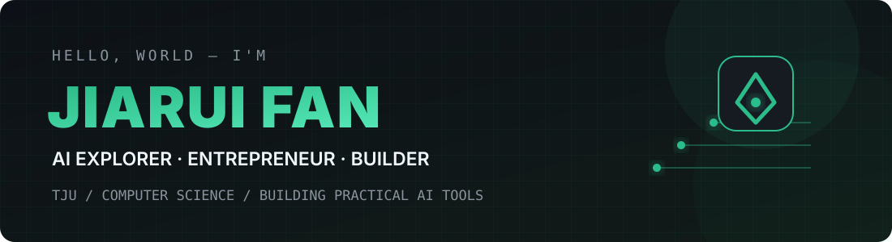
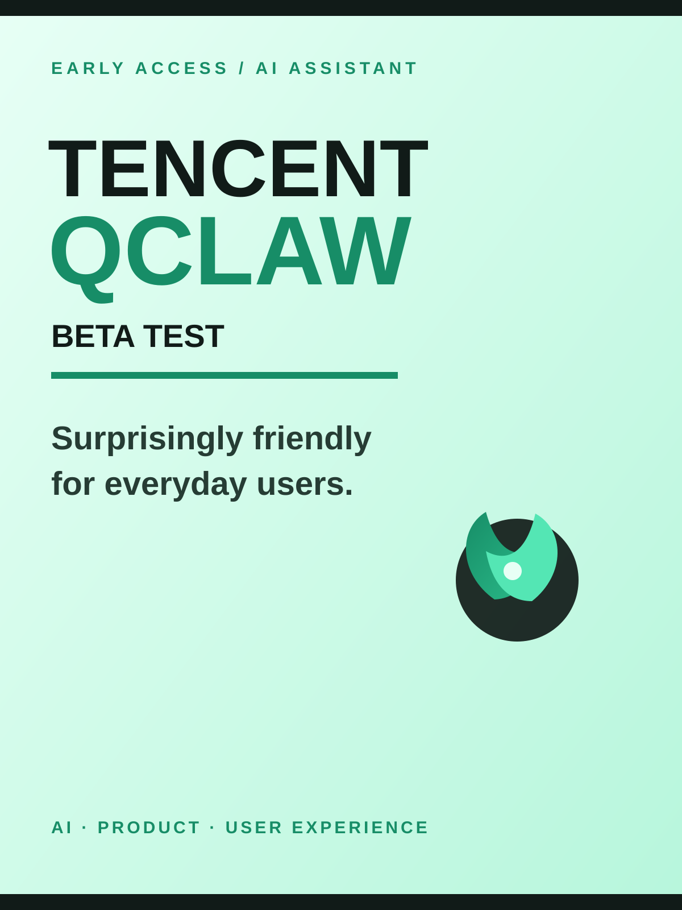

  

  <!-- Typing SVG by DenverCoder1: https://github.com/DenverCoder1/readme-typing-svg -->
  

<!-- Social links -->

  
  &nbsp;
  

 

<!-- Social proof badges -->

  
  

 

  
<h2>📘 My Top Open Source Projects</h2>

  

    
    
    
  

  

  
<h2>📕 Top Projects I've Contributed To</h2>

  

    
    
    
    
  

  
<h2>📕 Latest Xiaohongshu Notes</h2>

  <table>
    <tr>
      <td width="33%" valign="top">
         
        <b>Who Manages an AI Agent's Spending?</b> 
        AI Agents · FinOps · Product Thinking
      </td>
      <td width="33%" valign="top">
         
        <b>Tencent QClaw Beta: Friendly for Everyday Users</b> 
        AI Assistant · Product Experience · Early Access
      </td>
      <td width="33%" valign="top">
         
        <b>Automatic WeChat Article Organizer + AI Summarizer</b> 
        Automation · Knowledge Management · AI
      </td>
    </tr>
  </table>

  

  
<h2>🛠️ My Favorite Tools</h2>

  <h3>👨‍💻 Programming and Markup Languages</h3>
  

    
    
    
    
    
    
    
    
  

  <h3>🧰 Frameworks, Libraries, and AI</h3>
  

    
    
    
    
    
    
    
    
    
    
    
    
    
    
    
    
    
    
  

  <h3>🗄️ Databases, Platforms, and Runtime</h3>
  

    
    
    
    
    
    
  

  <h3>💻 Developer Tools</h3>
  

    
    
    
    
    
    
    
    
  

  
<h2>📊 Stats and Activity</h2>

  <h3>🔥 Streak Stats</h3>
  

    
  

  <h3>💻 GitHub Profile Stats</h3>
  

    
    
  

  
<b>Note:</b> Top languages only reflect the composition of my public repositories and do not represent my experience or skill level.

  

  <h3>⚡ Recent GitHub Activity</h3>

<!--RECENT_ACTIVITY:start-->
1. 💬 Commented on [#3462](https://github.com/rtk-ai/rtk/pull/3462#issuecomment-5491750058) in [rtk-ai/rtk](https://github.com/rtk-ai/rtk) 
2. 💬 Commented on [#9492](https://github.com/super-productivity/super-productivity/pull/9492#issuecomment-5469412754) in [super-productivity/super-productivity](https://github.com/super-productivity/super-productivity) 
3. ⭐ Starred [IAAR-Shanghai/Awesome-AI-Memory](https://github.com/IAAR-Shanghai/Awesome-AI-Memory) 
4. 💪 Opened PR [#3832](undefined) in [open-city-ai/haidian](https://github.com/open-city-ai/haidian) 
5. 💬 Commented on [#9492](https://github.com/super-productivity/super-productivity/pull/9492#issuecomment-5379123138) in [super-productivity/super-productivity](https://github.com/super-productivity/super-productivity) 
<!--RECENT_ACTIVITY:end-->

  Designed with curiosity, built with code, and colored in green.

